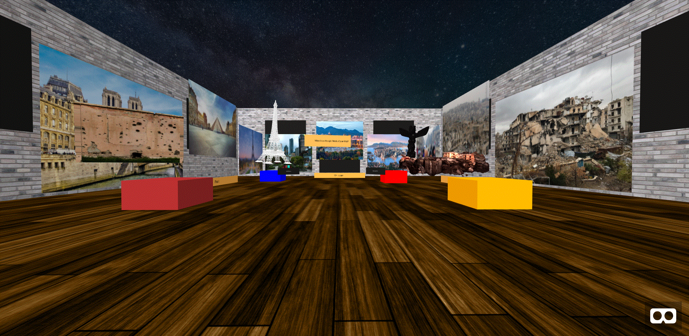

# What does Google Think of Your City?
## Interesting Screenshot of my visualization

## Link to my map
https://google-your-city.glitch.me/
## Reliance on other resources
I used A-Frame to design my visualization and rely upon the skills I learned from the A-frame academy projects to help me create a VR map that was interesting and meaningful.
## Reflective Analysis

I designed this visualization for people who has access to a computer and would use Google as their primary search engine. Some of the questions I attempt to raise are Why would google have certain kind of photos depicting your city and who has access towards allowing the photos to be put up in google about your city? My visualization is successful as it shows the top photos of your typical city and unsucessful that it only shows only 4 cities. My visualization engages in immersive/3d dimensions through VR and animation which adds a more personal understanding towards a city in google.

For this particular visualization, I chose to show two more developed cities Paris and Vancouver, and two less developed cities/countries Afghanistan and Aleppo. This is because I wanted to show the difference on how a major search engine like Google would depict those cities, one being well developed and clean, whereas the other, in a warzone and dirty. The visualization could be improved through allowing more pictures of the city they are particularly interested in to be in the VR experience and allow a search/filter button to switch between cities hence being able to see a plethora of images of their cities.
